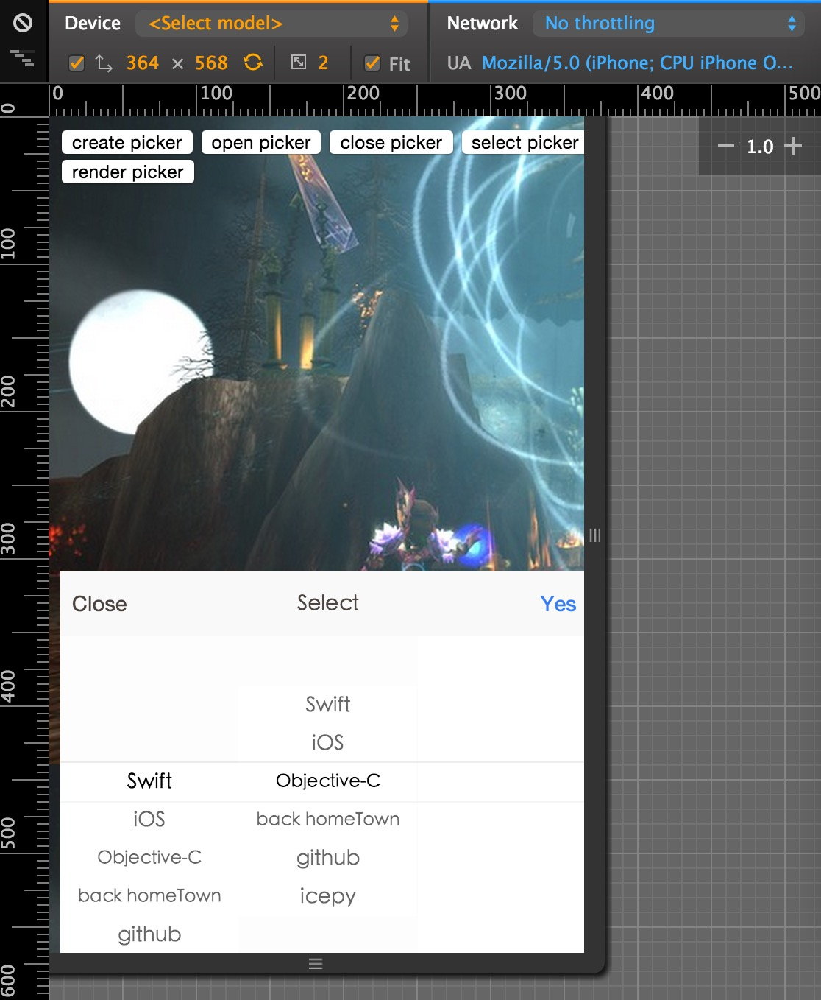

#UIPickerView

这是用来仿造iOS中的UIPickerView而编写的适用于移动端H5页的UI插件，可以适配在任何项目中，不依赖任何库或框架。

>Tag v1.0

穿山甲 [百科](http://baike.baidu.com/subview/11288/16772137.htm)

##Requirements

- iOS 7.0+

- android 4.1+

##使用之前请阅读(used befor reading)

这个插件的设计原则是，通过多个小的UIPickerView组装成一个大的UIPickerView，它只负责UIPickerView的核心操作部分与动画，这样设计的好处，是可以很灵活的进行组装，适用于多个不同的场景。

- 这个插件由UIPickerView和CAAnimation两个类组成
- UIPickerView负责与iOS操作一致的核心部分
- CAAnimation则只负责容器动画的显示与隐藏
- Demo例子中如果先点击open picker报错的原因是，你还没有先创建一个UIPickerView的实例

##Use it

需要实例化**UIPickerView**类，UIPickerView类也提供了一个简单的类方法，createPickerView来快速创建一个UIPickerView。

在使用之前还需要传入一个配置obj参数对象，各参数意义如下：

	dataSource:data,  //数据源
	id:'picker', //容器id
	constraintsId:'wower', //约束id
	kUP:{
		kUPCELLHEIGHT:44, //行高
		kUPFRICTION:0.003 //动画速率
	},
	valueChange:function(data){ //选择一项会触发的valueChange事件回调
		//UPNotificationCenter.postNotificationName('UPK',data);
	}

dataSource数据源的结构，渲染DOM结构依赖key，value键，具体的业务功能可以根据自己的需求来定义结构：

	var data = [
			{
				"key":"index", //下一个UIPickerView数据源的键
				"value":"index" //当前值
			},
	]

UIPickerView提供了三个方法来操作

>UPRender() 重新渲染内容区域部分

>UPSelectRowIndexPath() 自定义选择某一行

>UPThen() 选择了一行之后可以在这个回调中再做某些事情

##动画驱动

	animd = CAAnimation.createAnimation({id:'picker-wraper'});
	animd.start(); //开始
	animd.finish(); //完成

使用CAAnimation来创建一个动画，UIPickerView可以实现多个在一个容器中，显示的动画执行可以在CAAnimation中执行。

> id 指定需要动画的容器id

> WebKitanimation的动画参数都可支持

##注意事项

* 素材图片可替换PS:（找个美工妹纸帮你做漂亮些）
* cell的高度可定制，要求与css中的行高一致，并且可以与2取余
* 容器外css以及如何布局，都可以根据业务具体来替换，

##感谢

UIPickerView的图片素材是在这里下载的--[http://cubiq.org/](http://cubiq.org/)，**感谢**。

##效果图

